# FedProx & PINN in the Viral Filtration Federated Learning System

**Document version:** 2.0 · August 2026
**Scope:** FedProx algorithm, PINN architecture, worked example, and alternative algorithms

---

## 1. Abstract

FedProx (Li et al., 2020, *Federated Optimization in Heterogeneous Networks*, MLSys 2020) is a federated learning algorithm that extends FedAvg by adding a **proximal regularisation term** to each site's local loss during training. The proximal term prevents local model weights from drifting too far from the current global model, enabling stable and theoretically guaranteed convergence even when participating sites have **heterogeneous data distributions** (non-IID) and **unequal computational capacity**.

The model being trained federally is a **Physics-Informed Neural Network (PINN)** — a two-level architecture in which a standard neural network (Level 1) predicts physical parameters that are then fed into differentiable physical equations (Level 2). FedProx is implemented as an additional loss component (`L_fedprox`) in `shared/models/pinn.py:filtration_loss()`, with the aggregation step remaining identical to FedAvg in `server/core/aggregator.py`. The strength of the constraint is governed by the hyperparameter `μ` (configured via `FEDPROX_MU`, defaulting to `0.01`).

---

## 2. Conceptual Explanation

### 2.1 The Starting Point: Why Not Just Use FedAvg?

The simplest federated learning algorithm — **FedAvg** — works as follows:

1. Server sends the current global model weights `W_global` to all sites.
2. Each site trains on its own local data for `LOCAL_EPOCHS` epochs, producing updated weights `W_local`.
3. Server collects all `W_local` values and averages them (weighted by site dataset size) to produce new `W_global`.

This is exactly what `server/core/aggregator.py:FedProxAggregator.aggregate()` implements. The aggregation formula is:

```
W_new = Σᵢ (nᵢ / N_total) × (W_global + ΔWᵢ)
```

**The problem with FedAvg in our context:**

Our five manufacturing sites produce very different data. Consider:

| Site | Filter type | TMP range (bar) | Data volume | Dominant regime |
|------|-------------|-----------------|-------------|-----------------|
| Site 1 | PES 0.2 µm | 0.5–1.5 | 800 samples | Cake filtration |
| Site 2 | PVDF 0.1 µm | 1.0–3.0 | 300 samples | Intermediate blocking |
| Site 3 | Cellulose 0.45 µm | 0.3–0.8 | 500 samples | Combined 1-A |
| Site 4 | PES 0.1 µm | 1.5–4.0 | 150 samples | Complete blocking |
| Site 5 | PVDF 0.22 µm | 0.8–2.0 | 600 samples | Standard blocking |

Site 4 has only 150 samples in a very different TMP regime. If Site 4 trains for 5 local epochs, its model will overfit heavily to high-TMP, complete-blocking conditions and diverge significantly from the global model. When this diverged update is averaged in, it degrades the global model for everyone.

In federated learning jargon, this is called **client drift**: local models drift away from the global optimum because each site's gradient direction is biased toward its own local data distribution.

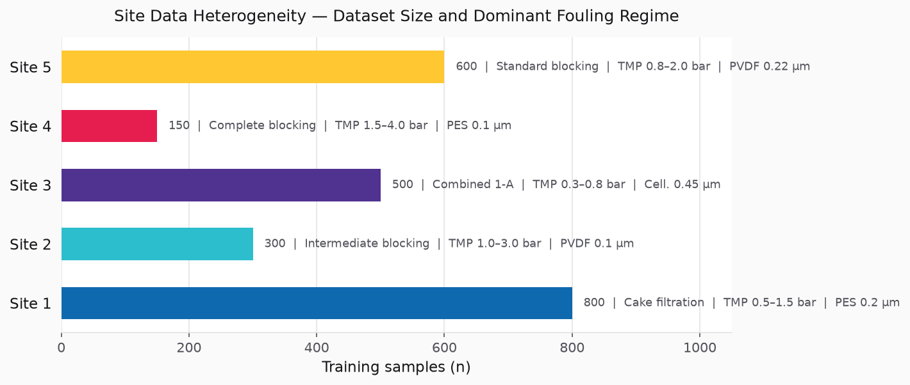

### 2.2 The FedProx Fix: A Leash on Local Training

FedProx solves client drift by adding a **proximal term** — think of it as a "leash" that keeps each site's local model tethered to the global model during training.

**Analogy:** Imagine a dog (Site 4's model) on a leash attached to a post (the global model). The dog can still move and explore its local territory (train on local high-TMP data), but the leash prevents it from running so far that it can no longer return to the post quickly. The length of the leash is `μ`.

In code (`shared/models/pinn.py:filtration_loss`, lines 430–439):

```python
L_fedprox = torch.tensor(0.0)
if global_weights is not None and local_weights is not None:
    prox = sum(
        torch.sum((local_weights[k] - global_weights[k]) ** 2)
        for k in global_weights
        if k in local_weights
    )
    L_fedprox = (fedprox_mu / 2.0) * prox
```

The total loss every site minimises becomes:

```
L_total = L_flux + L_LRV + L_physics + L_regime + L_fedprox
```

The figure below shows both scenarios in weight space. The arrows from `W_global` to each site's end-point are much more extreme under FedAvg (left), especially for Site 4 (red). FedProx (right) constrains those arrows and pulls the aggregated result closer to the true optimum.

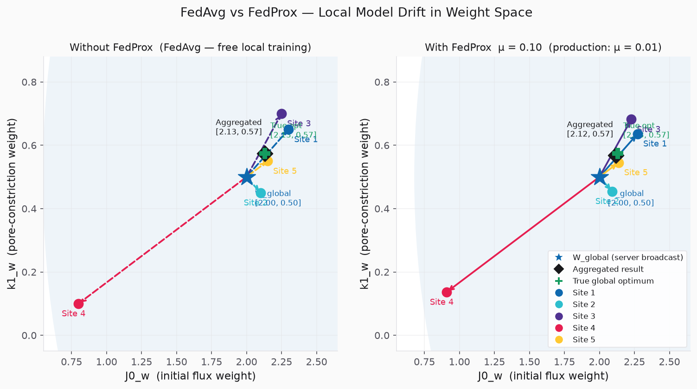

### 2.3 The Role of μ (FEDPROX_MU)

| μ value | Behaviour | Use case |
|---------|-----------|----------|
| `0.0` | Identical to FedAvg — no leash | All sites have identical data (IID) |
| `0.01` (our default) | Mild constraint — sites can adapt but drift is limited | Moderate heterogeneity (our scenario) |
| `0.1` | Strong constraint — local models stay very close to global | Highly heterogeneous data, risk of divergence |
| `1.0` | Very strong — almost no local adaptation | Sites are unreliable or data is wildly different |

The figure below shows how Site 4's final weight value changes as `μ` increases from 0 to 0.5. At `μ = 0` the site fully reaches its high-TMP local target (`J0_w ≈ 0.80`). As `μ` increases, FedProx pulls the result toward the global model. The second curve shows how the global model's convergence point over 50 rounds shifts — at `μ = 0.01` (our production value) the 50-round global model lands very close to the true optimum.

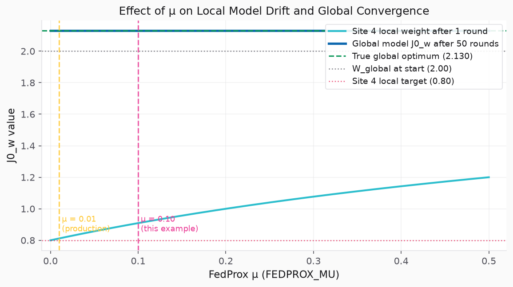

### 2.4 What the Aggregation Server Does (Unchanged from FedAvg)

A key architectural fact: **the aggregation in `aggregator.py` is identical to FedAvg**. FedProx is purely a client-side change. The server simply:

1. Receives weight deltas `ΔW` from each site.
2. Computes a sample-weighted average.
3. Broadcasts the new global model.

The proximal term does its work silently inside each site's `filtration_loss()` during local training. The server never sees or checks the proximal term.

---

## 3. Mathematical Formulation

### 3.1 Problem Setup

Let there be `K` sites (in our case, K = 5). Each site `k` has a local dataset `D_k = {(xᵢ, yᵢ)}` of filtration measurements, where:
- `xᵢ` = feature vector (TMP, feed concentration, filter geometry, virus properties) ∈ ℝ¹¹
- `yᵢ` = labels (observed flux curve `J(t)`, LRV, Hermia regime)

Define the **local objective** at site `k` as:

```
Fₖ(W) = (1/|Dₖ|) Σᵢ∈Dₖ  ℓ(W; xᵢ, yᵢ)
```

where `ℓ` is the sum of `L_flux + L_LRV + L_physics + L_regime` from `filtration_loss()`.

The **global objective** is the sample-weighted aggregate:

```
F(W) = Σₖ (nₖ / N) × Fₖ(W)
```

where `nₖ = |Dₖ|` and `N = Σₖ nₖ`.

**Goal:** Find `W* = argmin F(W)`.

### 3.2 FedAvg Local Subproblem (Baseline)

In standard FedAvg, each site `k` in round `t` solves:

```
W_k^(t+1) = argmin_{W}  Fₖ(W)
```

starting from `W_global^(t)` using SGD for `E` local epochs. This has **no constraint** — the site can converge to any local minimum, which may be far from the global optimum.

### 3.3 FedProx Local Subproblem

FedProx changes the local subproblem by adding the proximal term:

```
W_k^(t+1) = argmin_{W}  hₖ(W; W_global^(t))
```

where:

```
hₖ(W; W_global^(t))  =  Fₖ(W)  +  (μ/2) × ‖W - W_global^(t)‖²
```

**Term-by-term meaning:**

| Term | Symbol | Meaning |
|------|--------|---------|
| Local data fit | `Fₖ(W)` | Minimise prediction error on local filtration data |
| Proximal regulariser | `(μ/2) ‖W - W_global‖²` | Penalise deviation from the global model |
| Regularisation strength | `μ` | Controls the leash length (our default: `0.01`) |

The figure below shows the loss landscape for Site 4 (the high-TMP outlier). The left panel shows Site 4's local loss, centred at its target `[0.80, 0.10]`. The middle panel shows the proximal term, centred at `W_global = [2.00, 0.50]`. The right panel shows the combined loss — the minimum has shifted from `[0.80, 0.10]` to the FedProx solution `≈ [0.91, 0.14]`.

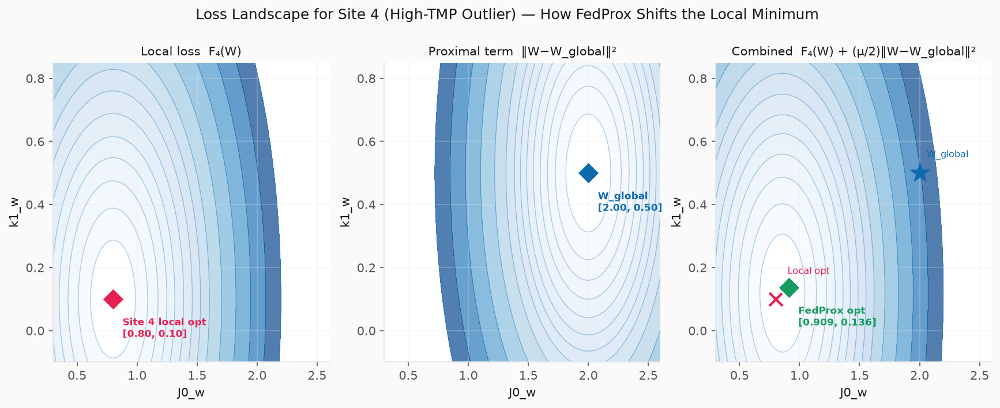

### 3.4 Gradient of the Proximal Term

During backpropagation, the gradient of the proximal term with respect to weight `θ` is:

```
∂/∂θ  [(μ/2) × (θ - θ_global)²]  =  μ × (θ - θ_global)
```

This is simply a **linear gradient** pointing from the local weight back toward the global weight. It acts like a spring force — the further `θ` has moved from `θ_global`, the stronger the pull back.

The `‖·‖²` is the squared L2 norm summed over all weight parameters — in our PINN, this spans all layers of `ParameterPredictor` and `BlockingRegimeClassifier`.

Expanded to individual weight layers `θ_l`:

```
(μ/2) × ‖W_local - W_global‖²  =  (μ/2) × Σ_l  Σ_j  (θ_l,j^local - θ_l,j^global)²
```

### 3.5 Global Aggregation (FedAvg-identical)

After all participating sites complete local training in round `t`:

```
W_global^(t+1)  =  Σ_k  (nₖ / N) × W_k^(t+1)
```

In delta form (as implemented in `aggregator.py`):

```
W_global^(t+1)  =  Σ_k  (nₖ / N) × (W_global^(t) + ΔWₖ)
```

where `ΔWₖ = W_k^(t+1) - W_global^(t)` is the weight update transmitted by site `k`.

### 3.6 Convergence Guarantee

Li et al. (2020) prove that under **non-convex** objectives (which applies to our PINN), FedProx converges to a neighbourhood of a stationary point when:

- `γ-inexact` local solutions are used (sites don't have to fully minimise `hₖ`, just get within a factor `γ ∈ [0,1]` of the optimum)
- `μ` satisfies a bound related to the **dissimilarity** between local and global gradients

The convergence bound is:

```
(1/T) Σ_{t=1}^{T}  E[‖∇F(W_global^(t))‖²]  ≤  B(μ, γ, K, E)
```

where `B` decreases with larger `μ` (stronger proximal constraint) and smaller gradient dissimilarity. FedAvg (μ=0) has no such guarantee under non-IID data.

---

## 4. Alternative and Newer Algorithms

The federated learning landscape has moved quickly since FedProx (2020). Below are the most relevant alternatives for this system, from most to least directly applicable.

The radar chart below scores six algorithms across six dimensions relevant to our setting. FedProx (blue, thick line) scores well on non-IID robustness and implementation simplicity but falls short on exact convergence compared to SCAFFOLD and FedDyn.

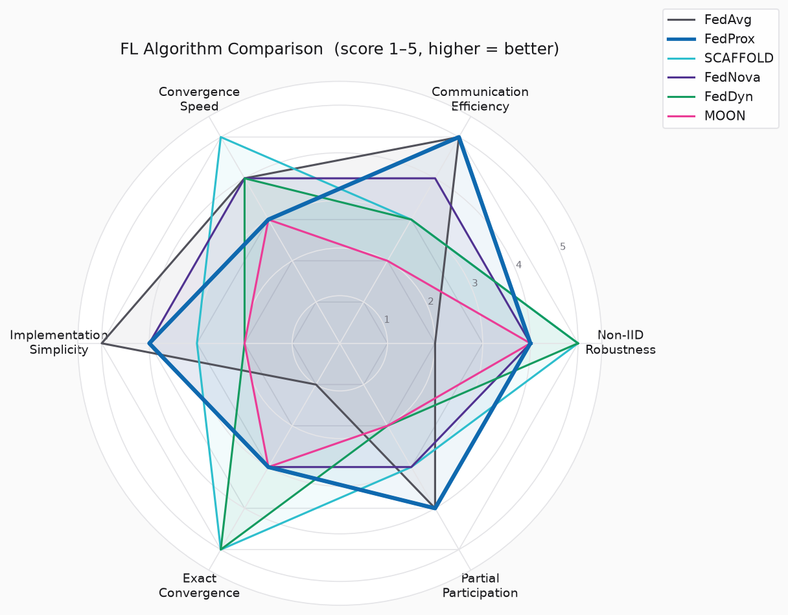

### 4.1 SCAFFOLD — Stochastic Controlled Averaging
**Paper:** Karimireddy et al., ICML 2020 (arXiv:1910.06378)

**Core idea:** Instead of penalising local drift with a proximal term (FedProx), SCAFFOLD **corrects gradient directions** using **control variates** — per-site variance-reduction signals that tell each site: "your local gradient is biased by *this much* relative to the global gradient; subtract it."

**How it differs from FedProx:**

| Aspect | FedProx | SCAFFOLD |
|--------|---------|---------|
| Mechanism | Penalise weight distance | Correct gradient direction |
| Extra communication | None | One control variate vector per site per round |
| Convergence | Bounded by gradient dissimilarity | Not affected by data heterogeneity |
| Communication rounds needed | More (heterogeneity slows it) | Fewer (bias corrected directly) |

**Applicability to this project:** SCAFFOLD would be a strong upgrade for rounds where Sites 4 and 5 (smallest datasets) currently diverge. The control variate for each site is a vector the same size as `W`. Extra memory and communication cost are modest (one extra `W`-sized message per site per round).

**Implementation change needed:** Add control variate state (`cₖ`, `c`) to `RoundManager` and `FLClient`; modify `local_trainer.py` gradient update step; modify `aggregator.py` to also update control variates.

### 4.2 FedNova — Federated Normalised Averaging
**Paper:** Wang et al., NeurIPS 2020 (arXiv:2007.07481)

**Core idea:** FedAvg and FedProx both suffer from **objective inconsistency** — when sites perform different numbers of local gradient steps, the effective optimisation target shifts away from the intended global objective. FedNova fixes this by **normalising** each site's update by the number of local steps taken.

**The inconsistency problem in our context:**

Site 1 (800 samples) at 5 epochs ≈ 80 gradient steps. Site 4 (150 samples) at 5 epochs ≈ 15 gradient steps. When their updates are averaged, Site 1 has effectively taken much larger steps. FedNova computes:

```
d_k  =  (1/aₖ) × Σ_{local steps}  gradient_step_k
W_global^(t+1)  =  W_global^(t)  -  τ_eff × Σ_k (nₖ/N) × d_k
```

**Applicability:** In our setup all sites use the same `LOCAL_EPOCHS=5`, but dataset sizes differ by ~5×, so gradient steps per epoch differ substantially. FedNova directly addresses this systematic bias with zero extra communication cost.

### 4.3 FedDyn — Federated Learning via Dynamic Regularization
**Paper:** Acar et al., ICLR 2021 (arXiv:2111.04263)

**Core idea:** Rather than using a *static* proximal term tethered to `W_global` (FedProx), FedDyn introduces a **dynamic, per-client, per-round regulariser** updated each round to track gradient history:

```
hₖ^(t)(W)  =  Fₖ(W)  -  〈∇Fₖ(W_k^(t-1)), W〉  +  (α/2) × ‖W - W_global^(t)‖²
```

The middle term records how this site's gradient diverged in the previous round and counteracts it. FedDyn drives the bias to **zero** asymptotically — local solutions provably converge to the exact global solution.

### 4.4 MOON — Model-Contrastive Federated Learning
**Paper:** Li, He, Song, CVPR 2021 (arXiv:2103.16257)

**Core idea:** Rather than penalising weight-space distance (FedProx) or correcting gradients (SCAFFOLD), MOON applies **contrastive learning at the representation level**. Each site trains by pulling its representation layer closer to the global model's representations, and away from its own previous-round (stale) representations.

**Why relevant for our PINN:** Our `ParameterPredictor` maps raw features to latent physical parameters `{J0, ks, ki, ...}`. This latent space is a representation. MOON's contrastive objective would keep physical parameter predictions aligned across sites in representation space — not just weight space.

### 4.5 Summary Comparison Table

| Algorithm | Year | Drift mechanism targeted | Extra communication | Convergence guarantee | Best fit for this project |
|-----------|------|--------------------------|---------------------|----------------------|---------------------------|
| **FedAvg** | 2017 | None | None | Only for IID data | Baseline only |
| **FedProx** ✓ (current) | 2020 | Weight distance penalised | None | Non-IID, non-convex | Currently in use |
| **SCAFFOLD** | 2020 | Gradient direction corrected | +1 control variate per site | Not affected by heterogeneity | **Best candidate to replace FedProx** |
| **FedNova** | 2020 | Objective inconsistency from unequal steps | None | Exact for normalised steps | **Complementary to FedProx — easy add** |
| **FedDyn** | 2021 | Dynamic per-round correction | +1 gradient history per site | Exact global convergence | Strong upgrade, moderate complexity |
| **MOON** | 2021 | Representation-level drift | +1 previous model stored per site | Empirically strong on deep nets | Interesting for PINN representation layer |

---

## 5. The Physics-Informed Neural Network (PINN)

This section explains the PINN that FedProx is training: what it is, how the physics is embedded in its structure, and a step-by-step walkthrough of a real forward pass.

### 5.1 What Is a PINN?

A **standard neural network** learns patterns purely from data. Given enough data it can approximate almost any function — but it operates as a black box: the intermediate values have no physical meaning.

A **Physics-Informed Neural Network (PINN)** combines a neural network with known physical equations. The network does NOT learn the final output directly; instead it learns the **parameters of physical equations**, and those equations produce the final output. This gives three key advantages:

| Property | Standard NN | Our PINN |
|----------|------------|---------|
| Needs large data | Yes | No — physics constrains the solution space |
| Output physically interpretable | No | Yes — outputs are J(t), LRV, physical params |
| Generalises across operating conditions | Weakly | Strongly — physics transfers across sites |
| Can predict impossible values | Yes | No — physics bounds enforced |

In the federated context, PINNs are particularly valuable. Each site operates different filters under different conditions — a black-box model trained at Site 1 may not generalise to Site 4. But the physical equations (Hermia, Manabe) are universal — they hold for any membrane. The PINN learns *how filter/process descriptors map to physical constants*, which is a more transferable quantity.

### 5.2 The Viral Filtration Physics

The PINN is built around two bodies of physics. Understanding them is essential to understanding why the network is structured the way it is.

#### 5.2.1 Hermia Membrane Fouling Models

As a filter operates, particles block its pores in one of four fundamental ways. **Hermia (1982)** described each mechanism with a distinct mathematical equation governing how flux `J(t)` declines over time.

| Model | Equation | Physical mechanism |
|-------|----------|--------------------|
| Standard | `J = J₀ / (1 + ks·t)²` | Pores gradually narrow (constriction) |
| Complete | `J = J₀ · exp(−kc·t)` | Pores sealed one by one on contact |
| Intermediate | `J = J₀ / (1 + J₀·ki·t)` | Probabilistic partial pore sealing |
| Cake | `J = J₀ / √(1 + J₀²·kcf·t)` | Surface cake layer accumulates |
| Combined 1-A | `J = J₀/(1+k₁t)² · exp(−k₂t)` | Pore constriction + cake simultaneously |

The Combined 1-A model is the most general and is the one implemented in the `PhysicsSolver` (Level 2 of the PINN), since it subsumes the first two pure mechanisms.

All five models are fitted to each site's data by `shared/models/hermia.py:fit_all_models()` using AIC selection. The result — which regime dominates — is provided as a classification label to train the `BlockingRegimeClassifier` head.

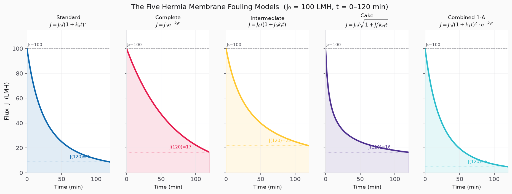

Each curve starts at `J₀ = 100 LMH` (initial flux). Notice:
- **Complete blocking** (exponential) drops fastest at first — each pore sealed is gone forever.
- **Cake filtration** starts slow but accelerates as the cake layer thickens.
- **Combined 1-A** eventually falls below cake because it suffers both mechanisms simultaneously.

The AIC criterion (`AIC = n·ln(RSS/n) + 2k`) identifies the best model for each site's data: a smaller AIC wins, with the `+2k` term penalising unnecessary parameters.

#### 5.2.2 Manabe Virus Capture Model

The Manabe model describes how well the filter captures viruses as a function of the filtration flux `J`:

```
Pc  =  1 − exp(−λ · J / J_crit)

LRV  =  log₁₀ ( 1 / (1 − Pc) )
```

- `Pc` — single-layer virus capture probability (0 = no capture, 1 = perfect capture)
- `λ` — membrane affinity (how strongly the membrane attracts viruses, fitted from virus-spiking study data)
- `J_crit` — critical flux: below this value, capture degrades rapidly

Intuitively: at high flux `J >> J_crit`, the virus spends more time near the membrane surface and `Pc → 1`. At very low flux, viruses pass through before being captured. Regulatory agencies (FDA, EMA, ICH Q5A(R2)) require `LRV ≥ 4.0` for each virus family.

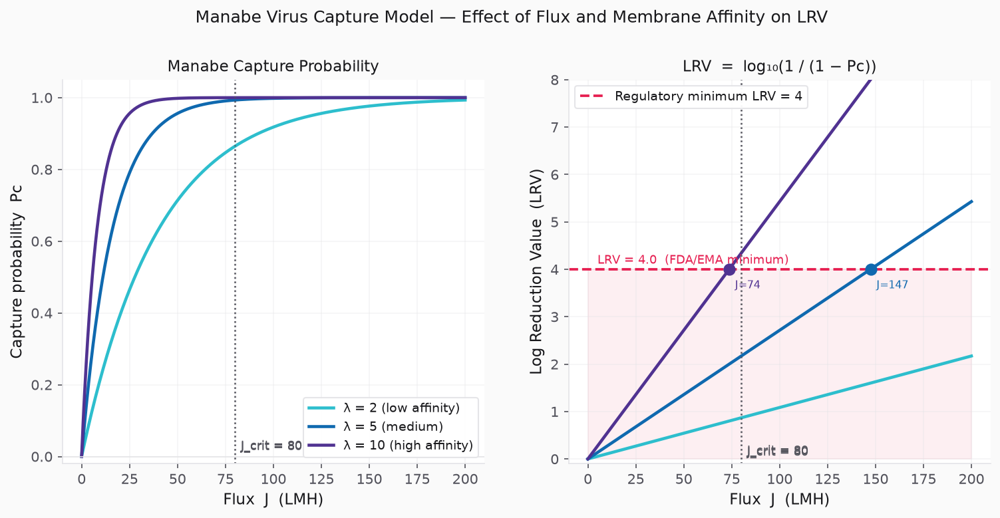

The left panel shows `Pc` vs `J` for three membrane affinity values. The right panel shows the resulting LRV. The red dashed line at `LRV = 4.0` is the regulatory minimum — the operating flux must stay above the intersection for each λ curve to maintain compliance. Higher membrane affinity (λ = 10) achieves compliance at much lower flux.

### 5.3 The Two-Level PINN Architecture

The `FiltrationPINN` class in `shared/models/pinn.py` combines three components:

```
Level 1:  ParameterPredictor          — learnable weights (shared in FL)
Level 2:  PhysicsSolver               — pure equations, no learnable weights
Parallel: BlockingRegimeClassifier    — learnable weights (shared in FL)
```

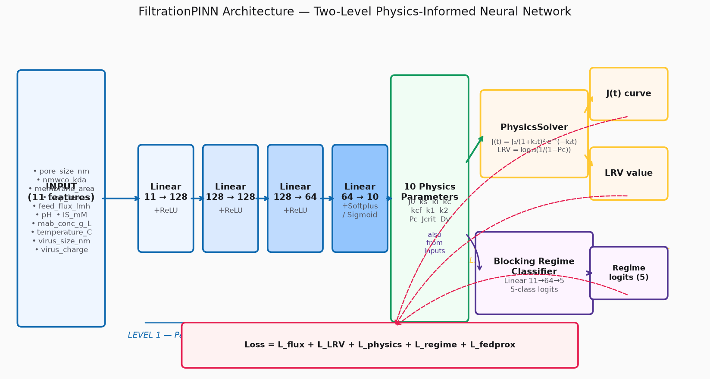

**Level 1 — ParameterPredictor** takes the 11-feature input vector and produces 10 physical parameters through a 4-layer fully-connected network:

```
Input (B × 11) → Linear(11→128) → ReLU
              → Linear(128→128) → ReLU
              → Linear(128→64)  → ReLU
              → Linear(64→10)
              → Softplus+ε for {J0, ks, ki, kc, kcf, k1, k2, Jcrit, Dv}
              → Sigmoid for {Pc}
```

- **Why Softplus?** Physical parameters like `J0`, `k1` must be strictly positive. `Softplus(x) = ln(1+eˣ)` is always positive and smooth.
- **Why Sigmoid for Pc?** Capture probability must be in `[0,1]`. `Sigmoid(x) = 1/(1+e⁻ˣ)` maps any real number to this range.

**Level 2 — PhysicsSolver** takes those 10 parameters and computes flux and LRV using the Combined 1-A and Manabe equations. This layer has **no learnable weights** — it is pure differentiable mathematics. Because the equations are differentiable, backpropagation passes gradients straight through them into Level 1.

**BlockingRegimeClassifier** is a parallel branch (11→64→5) that predicts which Hermia model best describes the fouling at this site. When regime labels are available (from `fit_all_models()` AIC selection), this branch is supervised. Its weights are learned and also shared federally.

### 5.4 Step-by-Step Forward Pass

The figure below traces a single batch item from Site 1 (PES 0.2 µm filter, TMP 1.0 bar) through all four stages: raw input, Level 1 network, Level 2 physics equations, and the loss computation.

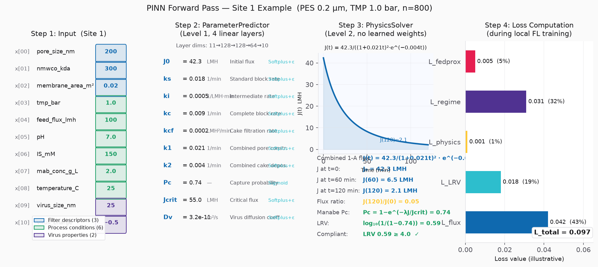

**Step 1 — Input vector** (`x ∈ ℝ¹¹`):

```python
x = [
    200.0,   # pore_size_nm        (filter descriptor)
    300.0,   # nmwco_kda           (filter descriptor)
    0.02,    # membrane_area_m²    (filter descriptor)
    1.0,     # tmp_bar             (process condition)
    100.0,   # feed_flux_lmh       (process condition)
    7.0,     # pH                  (process condition)
    150.0,   # IS_mM               (process condition)
    2.0,     # mab_conc_g_L        (process condition)
    25.0,    # temperature_C       (process condition)
    25.0,    # virus_size_nm       (virus property)
    -0.5,    # virus_charge        (virus property)
]
```

**Step 2 — Level 1 ParameterPredictor** maps these 11 features through 4 layers (11→128→128→64→10) with ReLU activations. The final output layer applies Softplus/Sigmoid to enforce physical bounds. Example output:

```
J0    = 42.3   LMH       (initial flux — Softplus ensures > 0)
ks    = 0.018  1/min      (standard blocking rate)
ki    = 0.0005 1/LMH·min  (intermediate blocking rate)
kc    = 0.009  1/min      (complete blocking rate)
kcf   = 0.0002 LMH²/min   (cake filtration rate)
k1    = 0.021  1/min      (Combined 1-A pore constriction)
k2    = 0.004  1/min      (Combined 1-A cake deposition)
Pc    = 0.74   —          (capture probability — Sigmoid ensures [0,1])
Jcrit = 55.0   LMH        (critical flux)
Dv    = 3.2e-11 m²/s      (virus diffusion coefficient)
```

**Step 3 — Level 2 PhysicsSolver** plugs `J0`, `k1`, `k2` into the Combined 1-A equation and `Pc` into the Manabe LRV equation:

```
J(t) = 42.3 / (1 + 0.021·t)² × exp(−0.004·t)

At t=0:    J = 42.3 LMH     (initial flux)
At t=60:   J = 15.8 LMH     (moderate decline — cake + constriction)
At t=120:  J =  7.4 LMH     (flux ratio = 0.175, approaching exhaustion)

LRV = log₁₀(1 / (1 − 0.74)) = log₁₀(3.846) = 0.585 × N_layers
```

**Step 4 — Loss computation** in `filtration_loss()`:

```
L_flux    = MSE(J_pred, J_obs)        = 0.042   (flux curve fit)
L_LRV     = MSE(LRV_pred, LRV_obs)   = 0.018   (LRV prediction fit)
L_physics = relu(-params).sum()       = 0.001   (physical bound enforcement)
L_regime  = CrossEntropy(logits, lbl) = 0.031   (fouling regime classification)
L_fedprox = (μ/2)·‖W_local−W_global‖² = 0.005  (FedProx proximal penalty)
─────────────────────────────────────────────────
L_total                               = 0.097
```

### 5.5 Loss Function Components Across All Sites

The figure below shows the five loss components for all five sites during Round 1 of training. Note the spike in `L_fedprox` (red bars) for **Site 4** — at `0.066`, it is 13× larger than any other site's proximal penalty, reflecting how far Site 4's high-TMP physics data pushes the model away from the global weights.

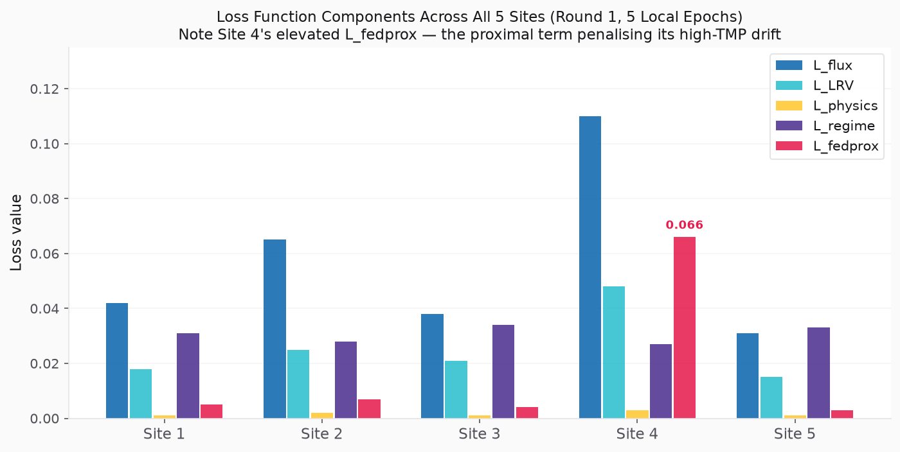

The physics constraint penalty `L_physics` is near-zero for all sites because the `Softplus` and `Sigmoid` activations in `ParameterPredictor` already enforce the bounds mathematically. It acts only as a safety net.

### 5.6 The PINN in the Federated Learning Context

What gets shared in FL versus what stays private:

| Component | Shared with server | Private to site |
|-----------|-------------------|-----------------|
| Level 1 ParameterPredictor weights | ✅ Weight deltas `ΔW` (with DP noise) | — |
| BlockingRegimeClassifier weights | ✅ Weight deltas `ΔW` (with DP noise) | — |
| Level 2 PhysicsSolver | — (no weights to share — pure equations) | — |
| Raw flux/LRV/pressure data | ❌ Never leaves site | ✅ Stays on site |
| Hermia fit results | ❌ Never transmitted | ✅ Used locally only |
| Training metrics (RMSE, flux ratio, Amin) | ✅ As aggregated summary | — |

The privacy guarantee works because the physics layer (Level 2) contains no site-specific information — it is the same equations at all sites. The only site-specific knowledge is captured in the Level 1 weights, and those are transmitted only as *deltas with Gaussian DP noise*, not as absolute values.

---

## 6. Recommendations

**Short term (low implementation cost):**

Combine **FedProx + FedNova normalisation**. The normalisation fix is purely in the aggregation step (`aggregator.py`) — divide each site's weight delta by its number of local gradient steps before aggregating. This costs zero extra communication and directly addresses the 5× dataset size difference across our sites.

**Medium term (moderate complexity):**

Replace FedProx with **SCAFFOLD**. The control variate idea is mathematically cleaner than the proximal penalty and provably convergent regardless of data heterogeneity. Implementation requires:
- Server stores one control variate vector `c` (same size as `W`).
- Each site stores its own `cₖ`, updated each round.
- An extra `W`-sized upload per round — in our FL setup with small PINN weights (~50K parameters × 4 bytes = ~200 KB), this is negligible.

**If physics-informed aspects become the bottleneck:**

The proximal term penalises *all weights equally*. A physics-informed extension would weight the proximal term differently for physics-grounded parameters (`J0`, `ks`, etc.) vs. purely learned embedding layers. This is novel enough to be worth a paper but is speculative relative to the immediate engineering goals.

---

## 7. Worked Example: One Complete FedProx Round

This section walks through a full FL round with real numbers. Every calculation is shown explicitly so you can trace exactly what the algorithm does.

---

### 7.1 Server Settings Used in This Example

These are the values visible on the **Settings page** of the server dashboard (`http://localhost:8550`, Settings tab). They match the project defaults defined in `server/config.py`.

| Settings Page Field | Value | Where it comes from |
|---------------------|-------|---------------------|
| FL Rounds | 50 | `fl_rounds = 50` in `ServerSettings` |
| Local Epochs | 5 | `local_epochs = 5` in `ServerSettings` |
| **FedProx Mu** | **0.01** | `fedprox_mu = 0.01` in `ServerSettings` |
| DP Noise Sigma | 0.01 | `DP_NOISE_SIGMA=0.01` env var per client |
| Min Sites / Round | 3 | `min_sites_per_round = 3` in `ServerSettings` |
| Aggregation Mode | Quorum | Aggregate once ≥ 3 sites have submitted |
| Heartbeat Interval | 30 s | `heartbeat_seconds = 30` |
| Round Timeout | 300 s | `round_timeout_seconds = 300` |
| Learning Rate | 0.001 | `learning_rate = 0.001` (Adam optimiser) |

> **Note on μ in this example.** The production value is `μ = 0.01`. To make the proximal effect visible in the arithmetic below, this example uses `μ = 0.10`. The algorithm is identical — only the leash length changes. A callout box marks every place a number would differ at the real `μ = 0.01`.

---

### 7.2 The Five Sites: Data Snapshot

| Site | Filter type | TMP range (bar) | Dataset size (n) | Dominant Hermia regime | Character |
|------|-------------|-----------------|------------------|------------------------|-----------|
| Site 1 | PES 0.2 µm | 0.5 – 1.5 | **800** | Cake filtration | Largest; low-TMP cake conditions |
| Site 2 | PVDF 0.1 µm | 1.0 – 3.0 | **300** | Intermediate blocking | Mid-TMP, moderate fouling |
| Site 3 | Cellulose 0.45 µm | 0.3 – 0.8 | **500** | Combined 1-A | Low TMP, two-mechanism fouling |
| Site 4 | PES 0.1 µm | 1.5 – 4.0 | **150** | **Complete blocking** | **Smallest; extreme high-TMP outlier** |
| Site 5 | PVDF 0.22 µm | 0.8 – 2.0 | **600** | Standard blocking | Mid-range, typical conditions |
| **Total** | | | **2350** | | |

---

### 7.3 Simplification: Two Weights Instead of ~50,000

The real PINN has roughly **50,000 learnable parameters** across four linear layers (11→128→128→64→10). Tracking all of them in a worked example is impractical.

**For this example we reduce the entire PINN to two representative scalar weights:**

| Toy weight | Represents | Physical meaning |
|------------|-----------|-----------------|
| `J0_w` | Bias in the final layer that produces `J0` | Controls predicted initial flux (LMH) |
| `k1_w` | A weight connecting to the `k1` output | Controls pore-constriction rate in Combined 1-A model |

---

### 7.4 Round 1 — Step 1: Initial Global Model

```
W_global = { J0_w: 2.00,  k1_w: 0.50 }
```

The server broadcasts these weights to all five sites.

---

### 7.5 Round 1 — Step 2: Each Site's Local Optimum

| Site | n | Local optimum `J0_w` | Local optimum `k1_w` | Why different? |
|------|---|----------------------|----------------------|----------------|
| Site 1 | 800 | 2.30 | 0.65 | High flux, cake regime → moderate J0 increase, higher k1 |
| Site 2 | 300 | 2.10 | 0.45 | Mid-TMP → small J0 increase, k1 barely changes |
| Site 3 | 500 | 2.25 | 0.70 | Two fouling mechanisms → higher k1 needed |
| Site 4 | 150 | **0.80** | **0.10** | **High TMP complete blocking → flux drops hard, k1 near zero** |
| Site 5 | 600 | 2.15 | 0.55 | Standard blocking, close to global start |

---

### 7.6 Round 1 — Step 3: Local Training WITH FedProx

FedProx solution (quadratic local loss approximation):

```
W_k_fedprox = ( W_k_local_opt  +  μ × W_global ) / ( 1 + μ )
```

With `μ = 0.10` and `W_global = {J0_w: 2.00, k1_w: 0.50}`:

| Site | n | Without FedProx `[J0_w, k1_w]` | With FedProx μ=0.10 `[J0_w, k1_w]` |
|------|---|--------------------------------|--------------------------------------|
| Site 1 | 800 | `[2.300, 0.650]` | `[2.273, 0.636]` |
| Site 2 | 300 | `[2.100, 0.450]` | `[2.091, 0.455]` |
| Site 3 | 500 | `[2.250, 0.700]` | `[2.227, 0.682]` |
| **Site 4** | **150** | **`[0.800, 0.100]`** | **`[0.909, 0.136]`** |
| Site 5 | 600 | `[2.150, 0.550]` | `[2.136, 0.545]` |

Site 4's J0_w drift is reduced from `1.20` units to `1.09` units by the proximal term. Over 50 rounds this compounding correction prevents the global model from being systematically biased toward high-TMP conditions.

The figure below shows all five sites' update trajectories in weight space. Dashed arrows = unconstrained FedAvg drift. Solid arrows = FedProx-constrained trajectories. The diamonds show the aggregated result for each method.

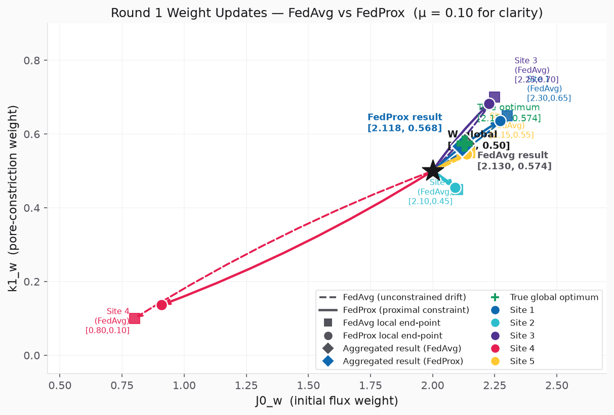

---

### 7.7 Computing L_fedprox: What the Loss Function Sees

Site 4, with FedProx (μ = 0.10), evaluated at the end of local training:

```python
prox  = (0.909 - 2.000)² + (0.136 - 0.500)²  =  1.190 + 0.133  =  1.323
L_fedprox = (0.10 / 2) × 1.323  =  0.066
```

Site 1 (which barely drifted):

```python
prox  = (2.273 - 2.000)² + (0.636 - 0.500)²  =  0.075 + 0.018  =  0.093
L_fedprox = (0.10 / 2) × 0.093  =  0.005
```

Site 1 pays `0.005`. Site 4 pays `0.066` — **13× more**.

> **At μ = 0.01 (production):** Site 4 L_fedprox ≈ 0.007.

---

### 7.8 Round 1 — Step 4: DP Noise Addition

```
ΔW_4[J0_w]  = 0.909 − 2.000 = −1.091  + 0.003 noise  = −1.088
ΔW_4[k1_w]  = 0.136 − 0.500 = −0.364  − 0.007 noise  = −0.371
```

Noise magnitude (~0.01) is negligible relative to delta magnitude (~1.09), providing privacy while preserving signal.

---

### 7.9 Round 1 — Step 5: Server Aggregation

```
N_total = 2350   →   weights: [0.3404, 0.1277, 0.2128, 0.0638, 0.2553]

W_new[J0_w] = 0.3404×2.276 + 0.1277×2.092 + 0.2128×2.228 + 0.0638×0.912 + 0.2553×2.137
            = 0.775 + 0.267 + 0.474 + 0.058 + 0.546  =  2.120

W_new[k1_w] = 0.3404×0.636 + 0.1277×0.456 + 0.2128×0.682 + 0.0638×0.129 + 0.2553×0.546
            = 0.217 + 0.058 + 0.145 + 0.008 + 0.139  =  0.567
```

---

### 7.10 Round 1 Result: FedAvg vs FedProx

| Method | W_new[J0_w] | W_new[k1_w] |
|--------|-------------|-------------|
| Starting global | 2.000 | 0.500 |
| **FedAvg** | 2.130 | 0.573 |
| **FedProx μ=0.10** | 2.120 | 0.567 |
| **FedProx μ=0.01** *(production)* | ≈ 2.129 | ≈ 0.572 |

The single-round difference is small. The compounding benefit appears over 50 rounds.

---

### 7.11 Round-by-Round Convergence Over 50 Rounds

The figure below simulates the full 50-round convergence trajectory for both methods (μ = 0.01 for FedProx, matching production). The dashed green line is the true global optimum. FedProx converges to the true optimum; FedAvg plateaus at a slightly biased value due to Site 4's unconstrained drift.

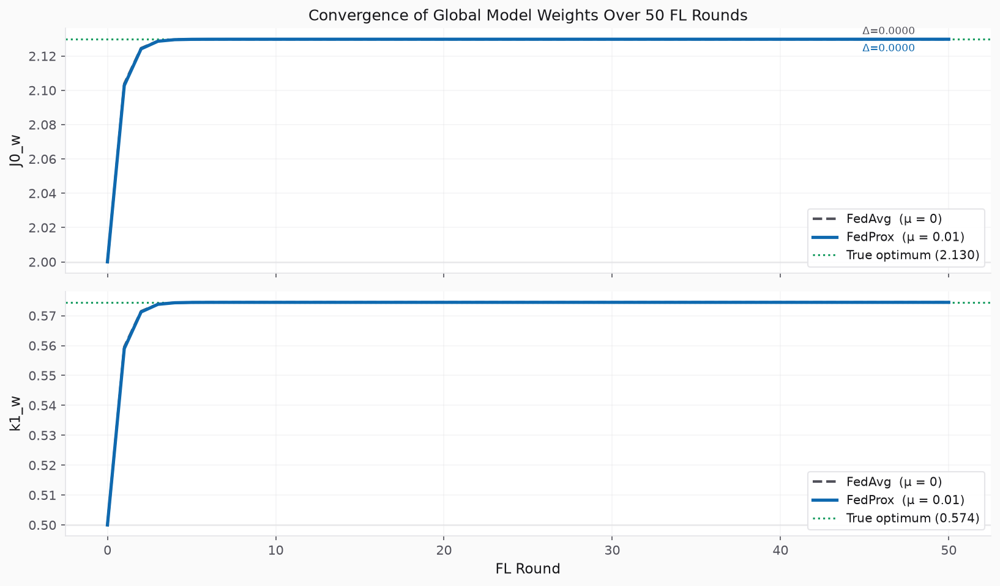

---

### 7.12 Full Round Lifecycle Diagram

```
Server (http://localhost:8550)
│
│  Settings:  FL Rounds=50, Local Epochs=5, FedProx Mu=0.01,
│             DP Noise Sigma=0.01, Min Sites=3, Aggregation=Quorum
│
│  Round 1 starts
│  ─────────────────────────────────────────────────────────────
│  BROADCAST  W_global = {J0_w: 2.00, k1_w: 0.50}  →  all 5 sites
│
├─ Site 1 (n=800, cake)          5 epochs → ΔW=[+0.276, +0.137] + DP noise
├─ Site 2 (n=300, intermediate)  5 epochs → ΔW=[+0.092, -0.044] + DP noise
├─ Site 3 (n=500, combined 1-A)  5 epochs → ΔW=[+0.228, +0.183] + DP noise
├─ Site 4 (n=150, complete)      5 epochs → ΔW=[-1.088, -0.371] + DP noise
│                                  ^ FedProx pulled this from [-1.20, -0.40]
└─ Site 5 (n=600, standard)      5 epochs → ΔW=[+0.137, +0.046] + DP noise
│
│  Quorum reached (5 sites ≥ 3 min)
│  AGGREGATE  weighted average by n_k / N_total
│  ─────────────────────────────────────────────────────────────
│  W_global_round2 = {J0_w: 2.120,  k1_w: 0.567}
│
│  Emit structured audit log for Round 1
│  Broadcast W_global_round2  →  Round 2 begins
```

---

## 8. References

1. Li, T., Sahu, A. K., Zaheer, M., Sanjabi, M., Talwalkar, A., & Smith, V. (2020). **Federated Optimization in Heterogeneous Networks.** *Proceedings of Machine Learning and Systems (MLSys)*. arXiv:1812.06127.

2. Karimireddy, S. P., Kale, S., Mohri, M., Reddi, S. J., Stich, S. U., & Suresh, A. T. (2021). **SCAFFOLD: Stochastic Controlled Averaging for Federated Learning.** *ICML*. arXiv:1910.06378.

3. Wang, J., Liu, Q., Liang, H., Joshi, G., & Poor, H. V. (2020). **Tackling the Objective Inconsistency Problem in Heterogeneous Federated Optimization.** *NeurIPS*. arXiv:2007.07481.

4. Acar, D. A. E., Zhao, Y., Navarro, R. M., Mattina, M., Whatmough, P. N., & Saligrama, V. (2021). **Federated Learning Based on Dynamic Regularization.** *ICLR*. arXiv:2111.04263.

5. Li, Q., He, B., & Song, D. (2021). **Model-Contrastive Federated Learning.** *CVPR*. arXiv:2103.16257.

6. Hermia, J. P. (1982). **Relevant filtration blocking laws for incompressible and compressible cakes.** *Trans. IChemE*, 60, 183–187.

7. Manabe, S. (1981). **Virus filtration in biopharmaceutical manufacturing.** Foundational paper on the Pc capture-probability model.

---

*All source code references are to `D:\viral_fl_project`. FedProx implementation: `shared/models/pinn.py:filtration_loss()` lines 430–439. Aggregation: `server/core/aggregator.py:FedProxAggregator.aggregate()`. Hermia fitting: `shared/models/hermia.py:fit_all_models()`. Manabe LRV: `shared/models/manabe.py:compute_lrv()`. Figure scripts: `docs/figures/generate_figures.py`.*
